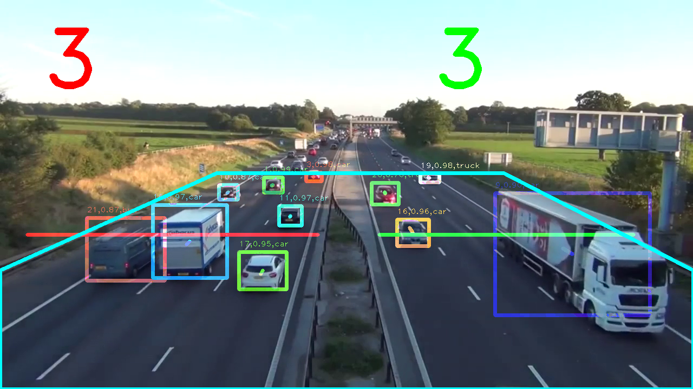

# Traffic-analysis

A traffic analysis system is built on the basis of the YOLO network. The system can track vehicles, count the number of vehicles in different lanes and show their trajectory. Also the area in which the vehicles should be detected can be specified.

